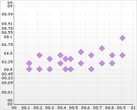

////

|metadata|
{
    "name": "chart-working-with-probability-chart-data",
    "controlName": ["{WawChartName}"],
    "tags": [],
    "guid": "{0998ADBD-0462-48F8-B618-E2963972C8DB}",  
    "buildFlags": [],
    "createdOn": "2006-02-03T00:00:00Z"
}
|metadata|
////

= Working with Probability Chart Data

This topic discusses useful information that will help you to ensure that your data is rendered properly in the probability chart.

== Data Requirements

While the Chart control allows you to easily point the chart to your own custom data, it is important that you are supplying the appropriate amount and type of data that the chart requires. If the data does not meet the minimum requirements based on the type of chart that you are using, an error will be generated.

The following is a list of data requirements for probability charts:

An important consideration to make when creating a probability chart is the range of the y-axis. Depending on the data, the range of probability can be between 0 and 1, or 0 and 100, -1 and 1, etc. For the best possible results, set the  pick:[win-forms=" link:{ApiPlatform}win.ultrawinchart{ApiVersion}~infragistics.ultrachart.resources.appearance.axisappearance~rangetype.html[RangeType]"]  pick:[asp-net=" link:{ApiPlatform}webui.ultrawebchart{ApiVersion}~infragistics.ultrachart.resources.appearance.axisappearance~rangetype.html[RangeType]"]  pick:[aspnet-old=" link:{ApiPlatform}webui.ultrawebchart{ApiVersion}~infragistics.ultrachart.resources.appearance.axisappearance~rangetype.html[RangeType]"]  property of the y-axis to Custom, and set the  pick:[win-forms=" link:{ApiPlatform}win.ultrawinchart{ApiVersion}~infragistics.ultrachart.resources.appearance.axisappearance~rangemin.html[RangeMin]"]  pick:[asp-net=" link:{ApiPlatform}webui.ultrawebchart{ApiVersion}~infragistics.ultrachart.resources.appearance.axisappearance~rangemin.html[RangeMin]"]  pick:[aspnet-old=" link:{ApiPlatform}webui.ultrawebchart{ApiVersion}~infragistics.ultrachart.resources.appearance.axisappearance~rangemin.html[RangeMin]"]  and  pick:[win-forms=" link:{ApiPlatform}win.ultrawinchart{ApiVersion}~infragistics.ultrachart.resources.appearance.axisappearance~rangemax.html[RangeMax]"]  pick:[asp-net=" link:{ApiPlatform}webui.ultrawebchart{ApiVersion}~infragistics.ultrachart.resources.appearance.axisappearance~rangemax.html[RangeMax]"]  pick:[aspnet-old=" link:{ApiPlatform}webui.ultrawebchart{ApiVersion}~infragistics.ultrachart.resources.appearance.axisappearance~rangemax.html[RangeMax]"]  properties accordingly.
The data set contains two numeric columns identified by the ColumnX and ColumnY properties.
* If you are binding the probability chart to a series object, see link:chart-requirements-for-series-binding.html[Requirements for Series Binding] for information on the series binding requirements.
* If you are using the probability chart in a link:chart-composite-chart.html[composite chart], see link:chart-axis-requirements-for-composite-charts.html[Axis Requirements for Composite Charts] for information on the axis requirements for the chart.

.Note
[NOTE]
====
If the data available is in a format where each column represents one line, and each row contains points for each line, then you should swap the rows and columns. For information on how to do this, see link:chart-swap-rows-and-columns.html[Swap Rows and Columns].
====

== Mapping Data to Probability Charts

See below for an example data set, along with the rendered probability chart. The "Variable column" is used for x-axis values and the "Probability" value is used for y-axis values.

[options="header", cols="a,a,a"]
|====
|Series Label|Variable|Probability

|Series A
|3
|0.435

|Series A
|4
|0.2174

|Series A
|4
|0.3913

|Series A
|5
|0.5652

|Series A
|6
|0.7391

|Series A
|8
|0.913

|Series B
|2
|0.1304

|Series B
|3
|0.3043

|Series B
|3
|0.4783

|Series B
|4
|0.6522

|Series B
|4
|0.8261

|Series C
|1
|0.435

|Series C
|1
|0.2174

|Series C
|2
|0.3913

|Series C
|2
|0.5652

|Series C
|2
|0.7391

|Series C
|4
|0.913

|Series D
|1
|0.1304

|Series D
|1
|0.3043

|Series D
|1
|0.4783

|Series D
|1
|0.6522

|Series D
|2
|0.8261

|====

