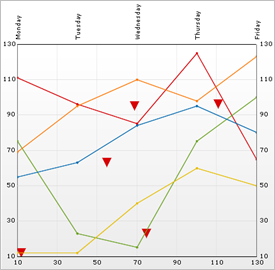

////

|metadata|
{
    "name": "chart-working-with-scatter-line-chart-data",
    "controlName": ["{WawChartName}"],
    "tags": [],
    "guid": "{171A1435-BCB7-4888-BCA7-8B89DADDEF25}",  
    "buildFlags": [],
    "createdOn": "2006-02-03T00:00:00Z"
}
|metadata|
////

= Working with Scatter Line Chart Data

This topic discusses useful information that will help you to ensure that your data is rendered properly in the scatter line chart.

== Data Requirements

While the Chart control allows you to easily point the chart to your own custom data, it is important that you are supplying the appropriate amount and type of data that the chart requires. If the data does not meet the minimum requirements based on the type of chart that you are using, an error will be generated.

The following is a list of data requirements for scatter line charts:

* The data set contains two numeric columns identified by the  pick:[win-forms=" link:{ApiPlatform}win.ultrawinchart{ApiVersion}~infragistics.ultrachart.resources.appearance.scatterchartappearance~columnx.html[ColumnX]"]  pick:[asp-net=" link:{ApiPlatform}webui.ultrawebchart{ApiVersion}~infragistics.ultrachart.resources.appearance.scatterchartappearance~columnx.html[ColumnX]"]  pick:[aspnet-old=" link:{ApiPlatform}webui.ultrawebchart{ApiVersion}~infragistics.ultrachart.resources.appearance.scatterchartappearance~columnx.html[ColumnX]"]  and  pick:[win-forms=" link:{ApiPlatform}win.ultrawinchart{ApiVersion}~infragistics.ultrachart.resources.appearance.scatterchartappearance~columny.html[ColumnY]"]  pick:[asp-net=" link:{ApiPlatform}webui.ultrawebchart{ApiVersion}~infragistics.ultrachart.resources.appearance.scatterchartappearance~columny.html[ColumnY]"]  pick:[aspnet-old=" link:{ApiPlatform}webui.ultrawebchart{ApiVersion}~infragistics.ultrachart.resources.appearance.scatterchartappearance~columny.html[ColumnY]"]  properties.
* Line data also requires one or more numeric columns and at least one row. If there are multiple rows of data, each row constitutes a separate line. Note that it is recommended that the data set contains two or more numeric columns so that each line can have two or more points.
* Both the  pick:[win-forms=" link:{ApiPlatform}win.ultrawinchart{ApiVersion}~infragistics.ultrachart.resources.appearance.dataappearance~datasource.html[UltraChart.ScatterLineChart.ScatterData.DataSource]"]  pick:[asp-net=" link:{ApiPlatform}webui.ultrawebchart{ApiVersion}~infragistics.ultrachart.resources.appearance.dataappearance~datasource.html[UltraChart.ScatterLineChart.ScatterData.DataSource]"]  pick:[aspnet-old=" link:{ApiPlatform}webui.ultrawebchart{ApiVersion}~infragistics.ultrachart.resources.appearance.dataappearance~datasource.html[UltraChart.ScatterLineChart.ScatterData.DataSource]"]  and  pick:[win-forms=" link:{ApiPlatform}win.ultrawinchart{ApiVersion}~infragistics.ultrachart.resources.appearance.dataappearance~datasource.html[UltraChart.ScatterLineChart.LineData.DataSource]"]  pick:[asp-net=" link:{ApiPlatform}webui.ultrawebchart{ApiVersion}~infragistics.ultrachart.resources.appearance.dataappearance~datasource.html[UltraChart.ScatterLineChart.LineData.DataSource]"]  pick:[aspnet-old=" link:{ApiPlatform}webui.ultrawebchart{ApiVersion}~infragistics.ultrachart.resources.appearance.dataappearance~datasource.html[UltraChart.ScatterLineChart.LineData.DataSource]"]  properties should be used to set data sources for scatter data as well as line data.

.Note
[NOTE]
====
If the data available is in a different format which is equivalent to a "sideways" version of these data requirements, then you can set the values of  pick:[win-forms=" link:{ApiPlatform}win.ultrawinchart{ApiVersion}~infragistics.ultrachart.resources.appearance.dataappearance~swaprowsandcolumns.html[UltraChart.ScatterLineChart.ScatterData.SwapRowsAndColumns]"]  pick:[asp-net=" link:{ApiPlatform}webui.ultrawebchart{ApiVersion}~infragistics.ultrachart.resources.appearance.dataappearance~swaprowsandcolumns.html[UltraChart.ScatterLineChart.ScatterData.SwapRowsAndColumns]"]  pick:[aspnet-old=" link:{ApiPlatform}webui.ultrawebchart{ApiVersion}~infragistics.ultrachart.resources.appearance.dataappearance~swaprowsandcolumns.html[UltraChart.ScatterLineChart.ScatterData.SwapRowsAndColumns]"]  and/or  pick:[win-forms=" link:{ApiPlatform}win.ultrawinchart{ApiVersion}~infragistics.ultrachart.resources.appearance.dataappearance~swaprowsandcolumns.html[UltraChart.ScatterLineChart.LineData.SwapRowsAndColumns]"]  pick:[asp-net=" link:{ApiPlatform}webui.ultrawebchart{ApiVersion}~infragistics.ultrachart.resources.appearance.dataappearance~swaprowsandcolumns.html[UltraChart.ScatterLineChart.LineData.SwapRowsAndColumns]"]  pick:[aspnet-old=" link:{ApiPlatform}webui.ultrawebchart{ApiVersion}~infragistics.ultrachart.resources.appearance.dataappearance~swaprowsandcolumns.html[UltraChart.ScatterLineChart.LineData.SwapRowsAndColumns]"]  to True.
====

== Mapping Data to Scatter Line Charts

The chart data is rendered using the following rules:

* If the  pick:[win-forms=" link:{ApiPlatform}win.ultrawinchart{ApiVersion}~infragistics.ultrachart.resources.appearance.scatterchartappearance~connectwithlines.html[ConnectWithLines]"]  pick:[asp-net=" link:{ApiPlatform}webui.ultrawebchart{ApiVersion}~infragistics.ultrachart.resources.appearance.scatterchartappearance~connectwithlines.html[ConnectWithLines]"]  pick:[aspnet-old=" link:{ApiPlatform}webui.ultrawebchart{ApiVersion}~infragistics.ultrachart.resources.appearance.scatterchartappearance~connectwithlines.html[ConnectWithLines]"]  property is True, then line segments connect the points identified by subsequent rows.

== Scatter Data

* Each row represents one scatter point.
* The columns at the indices specified by the ColumnX and ColumnY properties will be used to determine the horizontal (X) position, and vertical (Y) position of each scatter point.
* Scatter points can be grouped according to the value in a specific column by specifying the  pick:[win-forms=" link:{ApiPlatform}win.ultrawinchart{ApiVersion}~infragistics.ultrachart.resources.appearance.scatterchartappearance~groupbycolumn.html[GroupByColumn]"]  pick:[asp-net=" link:{ApiPlatform}webui.ultrawebchart{ApiVersion}~infragistics.ultrachart.resources.appearance.scatterchartappearance~groupbycolumn.html[GroupByColumn]"]  pick:[aspnet-old=" link:{ApiPlatform}webui.ultrawebchart{ApiVersion}~infragistics.ultrachart.resources.appearance.scatterchartappearance~groupbycolumn.html[GroupByColumn]"]  property, and setting the  pick:[win-forms=" link:{ApiPlatform}win.ultrawinchart{ApiVersion}~infragistics.ultrachart.resources.appearance.scatterchartappearance~usegroupbycolumn.html[UseGroupByColumn]"]  pick:[asp-net=" link:{ApiPlatform}webui.ultrawebchart{ApiVersion}~infragistics.ultrachart.resources.appearance.scatterchartappearance~usegroupbycolumn.html[UseGroupByColumn]"]  pick:[aspnet-old=" link:{ApiPlatform}webui.ultrawebchart{ApiVersion}~infragistics.ultrachart.resources.appearance.scatterchartappearance~usegroupbycolumn.html[UseGroupByColumn]"]  property to True. Different icons/colors will be used for scatter points in different groups. If the ConnectWithLines property is set to True, lines will connect only scatter points within the same group.
* The x-axis (or horizontal axis) is a SetLabelAxis object, with the points evenly spaced apart for each item (point). The y-axis, or vertical axis, is the numeric axis. Labels on the y-axis can be formatted using the  pick:[win-forms=" link:{ApiPlatform}win.ultrawinchart{ApiVersion}~infragistics.ultrachart.resources.appearance.axisserieslabelappearance~formatstring.html[FormatString]"]  pick:[asp-net=" link:{ApiPlatform}webui.ultrawebchart{ApiVersion}~infragistics.ultrachart.resources.appearance.axisserieslabelappearance~formatstring.html[FormatString]"]  pick:[aspnet-old=" link:{ApiPlatform}webui.ultrawebchart{ApiVersion}~infragistics.ultrachart.resources.appearance.axisserieslabelappearance~formatstring.html[FormatString]"]  property and a "numeric format":
[source]
----
UltraChart.Axis.Y.Labels.ItemFormatString = "<DATA_VALUE:##.##>"
----

== Line Data

* Each row is drawn as a single line on the chart, with a number of points in the line equal to the count of numeric columns in the data set.
* The first numeric column encountered in the data will be used for the value of the first point, the second column for the second point, and so on.
* The X2-axis (or top horizontal axis) is a "Set Label" axis, with the points evenly spaced apart for each item (point). The Y2-axis (or right vertical axis) is the numeric axis. Labels on the Y2-axis can be formatted using the FormatString property and a “numeric format”:
[source]
----
UltraChart.Axis.Y2.Labels.ItemFormatString = "<DATA_VALUE:##.##>"
----

See below for an example data set, along with the rendered scatter line chart.

[options="header", cols="a,a,a,a,a,a"]
|====
|StockName|Monday|Tuesday|Wednesday|Thursday|Friday

|IBM
|111
|96
|85
|125
|65

|MSN
|75
|23
|15
|75
|100

|MCI
|55
|63
|84
|95
|80

|ATT
|12
|12
|40
|60
|50

|VER
|69
|95
|110
|98
|123

|====

