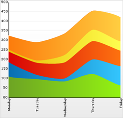

////

|metadata|
{
    "name": "chart-working-with-stacked-spline-area-chart data",
    "controlName": ["{WawChartName}"],
    "tags": [],
    "guid": "{DB35862C-821D-4C6B-97EC-3DD924E61707}",  
    "buildFlags": [],
    "createdOn": "2006-02-03T00:00:00Z"
}
|metadata|
////

= Working with Stacked Spline Area Chart Data

This topic discusses useful information that will help you to ensure that your data is rendered properly in the stacked spline area chart.

== Data Requirements

While the Chart control allows you to easily point the chart to your own custom data, it is important that you are supplying the appropriate amount and type of data that the chart requires. If the data does not meet the minimum requirements based on the type of chart that you are using, an error will be generated.

The following is a list of data requirements for stacked line charts:

* The data set contains one or more numeric columns. A numeric column is any DataColumn containing only values which can be interpreted as numbers. Note that it is recommended that the data set contains two or more numeric columns so that each line can have two or more points.
* The values in the data must be either all positive or all negative. Otherwise, it is logically impossible to represent the data as "stacked".
* If you are binding the stacked spline area chart to a series object, see link:chart-requirements-for-series-binding.html[Requirements for Series Binding] for information on the series binding requirements.
* If you are using the stacked spline area chart in a link:chart-composite-chart.html[composite chart], see link:chart-axis-requirements-for-composite-charts.html[Axis Requirements for Composite Charts] for information on the axis requirements for the chart.

.Note
[NOTE]
====
If the data available is in a format where each column represents one line, and each row contains points for each line, then you should swap the rows and columns. For information on how to do this, see link:chart-swap-rows-and-columns.html[Swap Rows and Columns].
====

== Mapping Data to Stacked Spline Area Charts

The chart data is rendered using the following rules:

* Each row is drawn as a single line on the chart, with a number of points in the line equal to the count of numeric columns in the data set.
* If there are multiple rows of data, each row constitutes a line.
* Every numeric column is displayed in the chart. The first numeric column encountered in the data will be used for the value of the first point, the second column for the second point, and so on. Note that a numeric column is any column that contains only values that can be interpreted as numbers.
* When the second line (row) is rendered, its points' values will be added to the points of the previous line. Therefore, each point going upwards on the chart is a cumulative total of values at that point.
* The x-axis (or horizontal axis) is a SetLabelAxis object, with the points evenly spaced apart for each item (point). The y-axis, or vertical axis, is the numeric axis. Labels on the y-axis can be formatted using the  pick:[win-forms=" link:infragistics4.win.ultrawinchart.v{ProductVersion}~infragistics.ultrachart.resources.appearance.axisserieslabelappearance~formatstring.html[FormatString]"]  pick:[asp-net=" link:infragistics4.webui.ultrawebchart.v{ProductVersion}~infragistics.ultrachart.resources.appearance.axisserieslabelappearance~formatstring.html[FormatString]"]  pick:[aspnet-old=" link:infragistics4.webui.ultrawebchart.v{ProductVersion}~infragistics.ultrachart.resources.appearance.axisserieslabelappearance~formatstring.html[FormatString]"]  property and a "numeric format":
[source]
----
UltraChart.Axis.Y.Labels.ItemFormatString = "<DATA_VALUE:##.##>"
----
* You can include or exclude any column from the chart using the UltraChart.Data. pick:[win-forms=" link:infragistics4.win.ultrawinchart.v{ProductVersion}~infragistics.ultrachart.data.chartdatafilter~includecolumn.html[IncludeColumn]"]  pick:[asp-net=" link:infragistics4.webui.ultrawebchart.v{ProductVersion}~infragistics.ultrachart.resources.appearance.dataappearance~includecolumn.html[IncludeColumn]"]  pick:[aspnet-old=" link:infragistics4.webui.ultrawebchart.v{ProductVersion}~infragistics.ultrachart.data.chartdatafilter~includecolumn.html[IncludeColumn]"]  method.

See below for an example data set, along with the rendered stacked spline area chart.

[options="header", cols="a,a,a,a,a,a"]
|====
|StockName|Monday|Tuesday|Wednesday|Thursday|Friday

|IBM
|111
|96
|85
|125
|65

|MSN
|75
|23
|15
|75
|100

|MCI
|55
|63
|84
|95
|80

|ATT
|12
|12
|40
|60
|50

|VER
|69
|95
|110
|98
|123

|====

