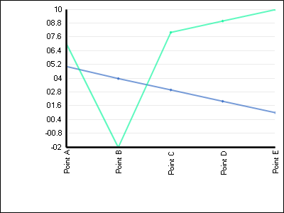

////

|metadata|
{
    "name": "webchart-creating-line-chart-using-code",
    "controlName": ["{WawChartName}"],
    "tags": [],
    "guid": "{704F8FE3-0895-464A-8828-C0A44E4C8FDF}",  
    "buildFlags": ["aspnet-old","asp-net"],
    "createdOn": "2008-06-08T10:50:46Z"
}
|metadata|
////

= Creating Line Chart Using Code

This tutorial walks through the process of creating a Line Chart™ using code. By the end of this tutorial, you will be familiar with creating a Line chart and binding a series collection to the chart.

Follow these steps to create 2D Line Chart:

[start=1]
. Create or open an existing Web Application.
[start=2]
. Please add the following Imports/using statements at the top of the code file.

*In Visual Basic:*

----
Imports Infragistics.WebUI.UltraWebChart
Imports Infragistics.UltraChart.Shared.Styles
Imports Infragistics.UltraChart.Resources.Appearance
Imports Infragistics.UltraChart.Core.Layers
----

*In C#:*

----
using Infragistics.WebUI.UltraWebChart;
using Infragistics.UltraChart.Shared.Styles;
using Infragistics.UltraChart.Resources.Appearance;
using Infragistics.UltraChart.Core.Layers;
----

[start=5]
. Declare and instantiate the chart. Add the chart to the form and set the Chart type to Line Chart in the Page_load event using the following code.

*In Visual Basic:*

----
' Declare and instantiate the chart
Dim theChart As New UltraChart()
' Add the chart to the form 
Me.FindControl("Form1").Controls.Add(theChart)
' Set the Chart type to LineChart 
theChart.ChartType = ChartType.LineChart
----

*In C#:*

----
protected void Page_Load(object sender, EventArgs e)
        {
	        // Declare and instantiate the chart
	        UltraChart theChart = new UltraChart();
               // Add the chart to the form
               this.FindControl("Form1").Controls.Add(theChart);
               // Set the Chart type to LineChart
               theChart.ChartType = ChartType.LineChart;    
        }       
----

[start=8]
. The following two methods will be used to generate sample data that will populate the chart.Add these methods to the code file.

*In Visual Basic:*

----
Private Shared Function GetNumericSeries() As NumericSeries
        Dim series As New NumericSeries()
        ' This code populates the series using unbound data 
	series.Points.Add(New NumericDataPoint(5, "Point A", False))
	series.Points.Add(New NumericDataPoint(4, "Point B", False))
        series.Points.Add(New NumericDataPoint(3, "Point C", False))
        series.Points.Add(New NumericDataPoint(2, "Point D", False))
        series.Points.Add(New NumericDataPoint(1, "Point E", False))
        Return series
End Function
Private Shared Function GetNumericSeries1() As NumericSeries
        Dim series1 As New NumericSeries()
' This code populates the series using unbound data 
        series1.Points.Add(New NumericDataPoint(7, "Point A", False))
        series1.Points.Add(New NumericDataPoint(-2, "Point B", False))
        series1.Points.Add(New NumericDataPoint(8, "Point C", False))
        series1.Points.Add(New NumericDataPoint(9, "Point D", False))
        series1.Points.Add(New NumericDataPoint(10, "Point E", False))
        Return series1
End Function
----

*In C#:*

----
private static NumericSeries GetNumericSeries1()
        {
            NumericSeries series1 = new NumericSeries();
            // This code populates the series using unbound data
            series1.Points.Add(new NumericDataPoint(7.0, "Point A", false));
            series1.Points.Add(new NumericDataPoint(-2.0, "Point B", false));
            series1.Points.Add(new NumericDataPoint(8.0, "Point C", false));
            series1.Points.Add(new NumericDataPoint(9.0, "Point D", false));
            series1.Points.Add(new NumericDataPoint(10, "Point E", false));
            return series1;
        }
----

[start=11]
. In the Page_Load event add the series collection to the Line Chart.

*In Visual Basic:*

----
Protected Sub Page_Load(ByVal sender As Object, ByVal e As System.EventArgs) Handles Me.Load
' Add the first series to the Line Chart
Dim numseries As NumericSeries = GetNumericSeries()
theChart.LineChart.ChartComponent.Series.Add(numseries)
//Add the second series to the Line Chart 
Dim numseries1 As NumericSeries = GetNumericSeries1()
theChart.LineChart.ChartComponent.Series.Add(numseries1)
End Sub
----

*In C#:*

----
protected void Page_Load(object sender, EventArgs e)
        {
           // Add the first series to the Line Chart
            NumericSeries numseries = GetNumericSeries();
            theChart.LineChart.ChartComponent.Series.Add(numseries);
           // Add the second series to the Line Chart 
            NumericSeries numseries1 = GetNumericSeries1();
            theChart.LineChart.ChartComponent.Series.Add(numseries1);
        }
----

The example code will generate the following Chart:

